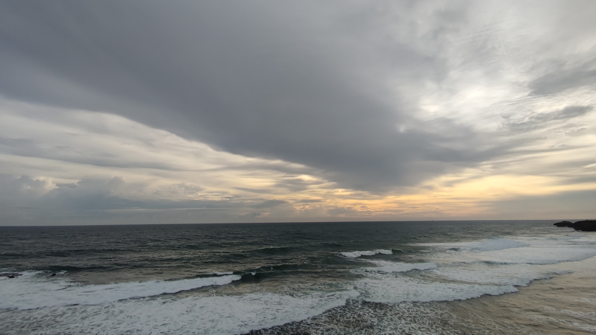

> Peace in motion.

<br>

📑 **Latest posts on [odhyp.com][website-url]**

<!-- BLOG-POST-LIST:START -->
- [Automatically Open External Links in New Tabs in Astro](https://odhyp.com/astro-opening-external-links/)
- [Migrating to Astro](https://odhyp.com/migrating-to-astro/)
- [Upgrading a Hugo Site to Tailwind CSS v4](https://odhyp.com/upgrading-a-hugo-site-to-tailwindcss-v4/)<!-- BLOG-POST-LIST:END -->

<br>

📊 **GitHub stats**

 &nbsp; 

<br>

📆 **This week in code**

<!--START_SECTION:waka-->

```bash
Total Time: 11 hrs 51 mins

Astro        6 hrs 19 mins   >>>>>>>>>>>>>------------   53.26 %
Python       4 hrs 10 mins   >>>>>>>>>----------------   35.17 %
CSS          26 mins         >------------------------   03.69 %
TypeScript   22 mins         >------------------------   03.18 %
MDX          19 mins         >------------------------   02.80 %
```

<!--END_SECTION:waka-->

<br>

⚙️ **Other stats**

![Profile Views][view-shield]
![Total Stars][stars-shield]
[![Comments][comments-shield]][comments-url]

<!-- LINKS & IMAGES -->
[website-url]: https://odhyp.com
[view-shield]: https://komarev.com/ghpvc/?username=odhyp&color=00bba7&style=for-the-badge&abbreviated=true
[stars-shield]: https://img.shields.io/github/stars/odhyp?style=for-the-badge&label=total%20stars&color=00bba7
[comments-shield]: https://img.shields.io/github/discussions/odhyp/odhyp?style=for-the-badge&label=comments&color=00bba7
[comments-url]: https://github.com/odhyp/odhyp/discussions
